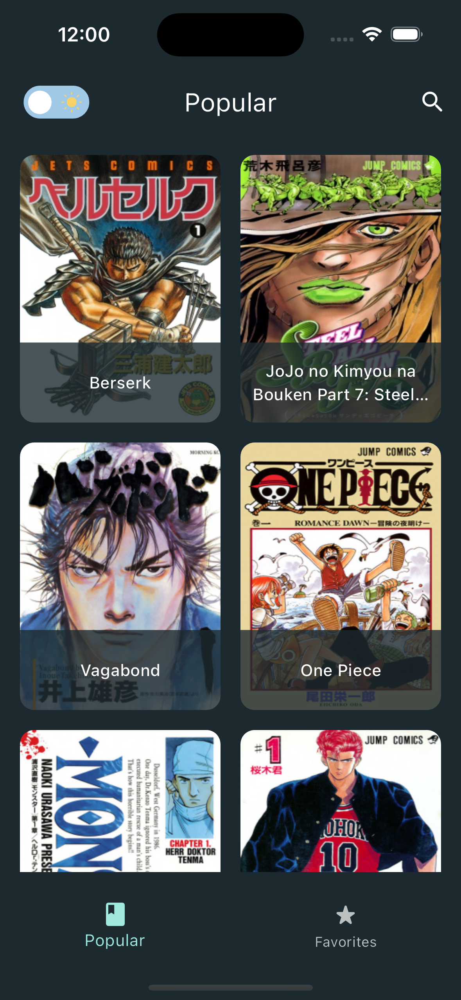
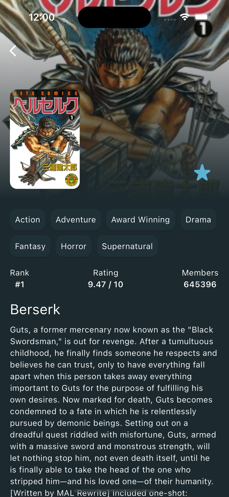

# Manga App

Manga app with a feature-first layered clean architecture, generic caching, lazy loading, debouncing, throttling, and adaptive theming. The UI of the app is intentionally kept simple, as my primary objective was to showcase the implementation of clean architecture, generic caching, lazy loading, debouncing, and throttling.

## Features

- Popular Mangas List: The app displays a list of popular mangas. This list is loaded lazily to optimize performance and reduce initial loading times. Additionally, throttling is implemented to minimize consecutive API calls.
- View Details: Access detailed information about each manga.
- Favorites: Add and store favorite mangas locally using [HiveDB](https://pub.dev/packages/hive).
- Search: Find any manga with the search feature. Debouncing technique is used to prevent unnecessary API calls.
- Adaptive Theme: The app automatically adjusts its theme based on the device's settings and remembers user preferences.

## Built With

- [Flutter](https://flutter.dev/)
- [Dart](https://dart.dev/)
- [Jikan API v4](https://docs.api.jikan.moe/)

## Preview

<p>
    
    
    
    
    
</p>

## Folder Structure

- "app" folder holds files specific to this particular application.
- "core" folder contains application-agnostic code that can be reused in other projects.
- "feature" folder represents the app's feature set. Each feature is divided into subfolders for data, domain, and presentation.

## Packages

- State Management
  - [Bloc](https://pub.dev/packages/flutter_bloc)
- Caching
  - [Hive](https://pub.dev/packages/hive)
  - [HydratedBloc](https://pub.dev/packages/hydrated_bloc)
- Networking
  - [Dio](https://pub.dev/packages/dio)
  - [PrettyDioLogger](https://pub.dev/packages/pretty_dio_logger)
  - [DioSmartRetry](https://pub.dev/packages/dio_smart_retry)
- Routing
  - [AutoRoute](https://pub.dev/packages/auto_route)
- Dependency Injection
  - [GetIt](https://pub.dev/packages/get_it)
- JsonParsing
  - [JsonSerializable](https://pub.dev/packages/json_serializable)
- Localization
  - [EasyLocalization](https://pub.dev/packages/easy_localization)
- Functional Programming
  - [FpDart](https://pub.dev/packages/fpdart)
- Logging
  - [Logger](https://pub.dev/packages/logger)
- Testing
  - [Mocktail](https://pub.dev/packages/mocktail)
  - [BlocTest](https://pub.dev/packages/bloc_test)

### Run this project

##### Clone this repository

```sh
git clone https://github.com/cem256/manga_clean_arch
```

##### Go to the project directory

```sh
cd manga_clean_arch
```

##### Get all the packages

```sh
flutter pub get
```

##### Execute these scripts in the terminal

```sh
sh scripst/build_runner.sh
sh scripts/localization.sh
```

##### Run the project
